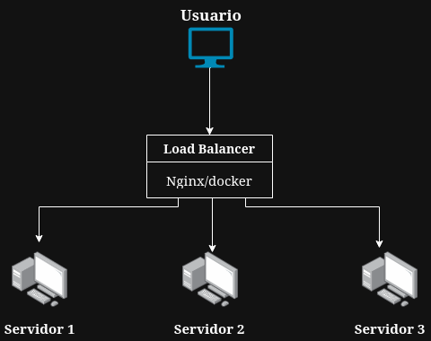

# Balanceador de Carga con Docker y Nginx

## Descripcion

En esta actividad se implementó un balanceador de carga utilizando Nginx y Docker, aplicando el algoritmo Round Robin para distribuir solicitudes entre dos servidores web.

Cada servidor muestra un mensaje distinto para identificar cuál responde la solicitud.

Server1 muestra: Hola mundo desde server 1  
Server2 muestra: Hola mundo desde server 2

---

## Infraestructura

Cliente → Load Balancer (Nginx) → Server1  
                                 → Server2  

El balanceador recibe todas las peticiones y las distribuye entre los servidores.

---

## Diagrama de Infraestructura

---

## Requisitos

Tener instalado Docker y Docker Compose en Ubuntu.

---

## Como ejecutar la infraestructura

1. Clonar el repositorio

git clone https://github.com/Catherine707/load-balancer-docker.git

2. Entrar a la carpeta

cd load-balancer-docker

3. Levantar los contenedores

docker compose up -d

4. Abrir en el navegador

http://localhost:8080

Refrescar varias veces para ver cómo cambia entre Server1 y Server2.

---

## Como detener la infraestructura

docker compose down

---

## Tecnologias utilizadas

Docker  
Docker Compose  
Nginx  
HTML  

---

## Arquitectura del sistema

Se utilizaron tres contenedores:

- server1: servidor web con HTML simple  
- server2: servidor web con HTML simple  
- loadbalancer: Nginx configurado como proxy reverso  

Nginx usa el algoritmo Round Robin por defecto para alternar solicitudes.

---

## Algoritmo de Balanceo

Se utilizó Round Robin, que distribuye las solicitudes de manera equitativa entre server1 y server2.

Ejemplo de funcionamiento:

Peticion 1 → Server1  
Peticion 2 → Server2  
Peticion 3 → Server1  
Peticion 4 → Server2  

---

## Evidencia de funcionamiento

Al refrescar el navegador en http://localhost:8080 se alterna entre los mensajes de cada servidor.

---

## Autor

Catherine Cotí

